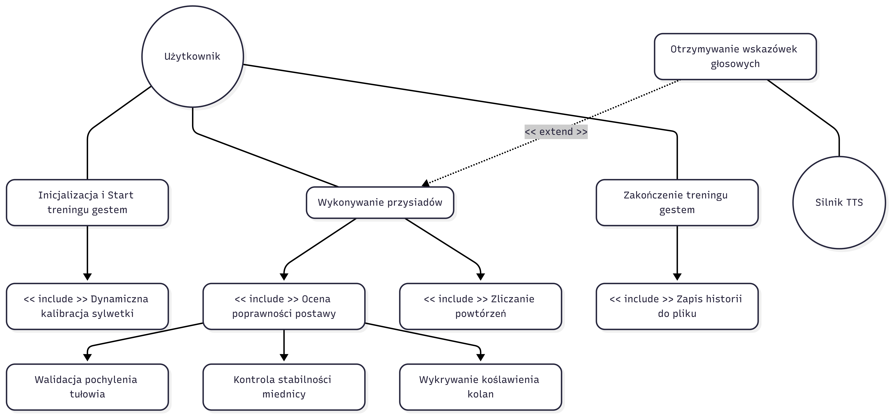
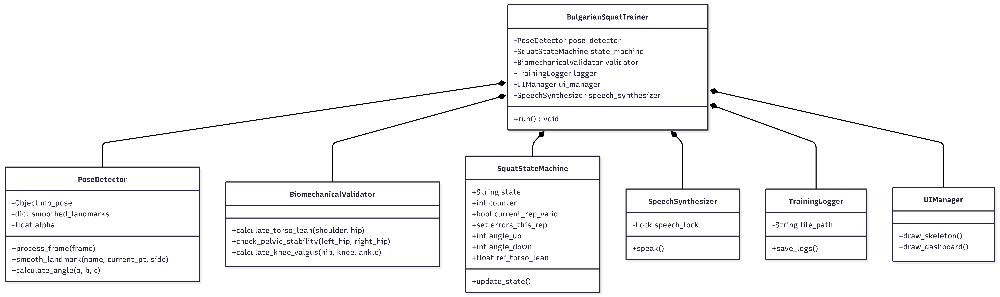
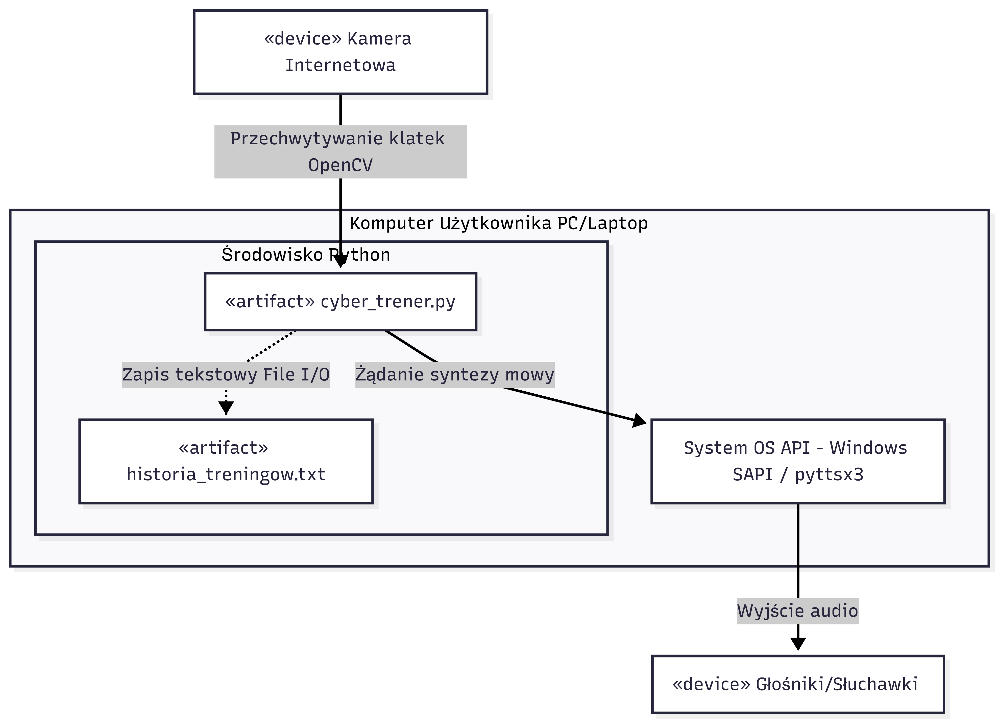

## 1. Specyfikacja Wymagań i Reguł Biomechanicznych

### Cel systemu
Aplikacja służy do automatycznego monitorowania, oceny i zliczania powtórzeń podczas wykonywania przysiadów bułgarskich za pomocą analizy obrazu z kamery w czasie rzeczywistym. System ma na celu eliminowanie najczęstszych błędów technicznych zagrażających zdrowiu ćwiczącego.

### Bezdotykowy system sterowania (Gesty)
* **Start systemu:** Uniesienie obu rąk (nadgarstki powyżej linii oczu) przez minimum 2 sekundy aktywuje tryb kalibracji i rozpoczyna trening.
* **Stop systemu:** Skrzyżowanie rąk na klatce piersiowej (nadgarstki blisko siebie, poniżej linii ramion i powyżej bioder) przez 2 sekundy kończy trening i zapisuje historię sesji.

### Algorytmy walidacji postawy i progi tolerancji
Wersja PRO wprowadza dynamiczną kalibrację anatomiczną oraz zaawansowaną kontrolę stabilizacji wielopłaszczyznowej:

1. **Dynamiczna Kalibracja Zakresu Ruchu:** Podczas startu system mierzy naturalny kąt stania użytkownika (K_stand). Na tej podstawie wyliczane są indywidualne progi:
   * **Faza górna (GÓRA):** Kąt w kolanie >= K_stand - 5°
   * **Faza dolna (DÓŁ):** Kąt w kolanie <= K_stand - 55° (głęboki, bezpieczny przysiad).
2. **Kontrola Pochylenia Tułowia:** System zapamiętuje wyjściowy kąt pleców podczas stania. Jeśli w trakcie przysiadu odchylenie tułowia od pozycji referencyjnej przekroczy 30°, aktywowany jest błąd *"Wyprostuj plecy!"*.
3. **Stabilizacja Miednicy (Pelvic Stability):** Aplikacja śledzi pozycję bioder w przestrzeni 3D:
   * **Asymetria wysokości (Oś Y):** Różnica pozycji bioder > 0.06 generuje błąd *"Krzywe biodra!"*.
   * **Rotacja/Skręt miednicy (Oś Z):** Różnica głębokości bioder > 0.12 generuje błąd *"Nie skręcaj bioder!"*.
4. **Wykrywanie Koślawienia Kolana (Knee Valgus):**
   Mierzone jest lateralne odchylenie kolana od osi biodro-kostka w płaszczyźnie czołowej (Oś X). Przekroczenie progu 35 pikseli do wewnątrz generuje alert *"Kolano ucieka do środka!"*.

### Odnośniki do źródeł wiedzy biomechanicznej
Logika biznesowa systemu została oparta na poniższych publikacjach naukowych:
* *Biomechanics of the Single-Leg Squat and Bulgarian Split Squat:* [National Strength and Conditioning Association (NSCA)](https://www.nsca.com)
* *Knee valgus and pelvic drop in unilateral lower extremity exercises:* [Journal of Sports Science & Medicine](https://www.jssm.org)

---

## 2. Diagram Przypadków Użycia (Use Case Diagram)

---

## 3. Wysokopoziomowy Diagram Klas (Class Diagram)

---

## 4. Diagram Wdrożenia (Deployment Diagram)

